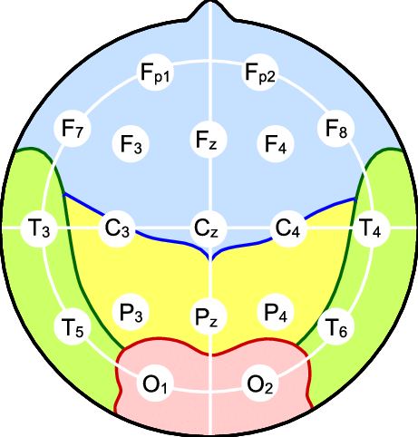

# Harmful Brain Activity Classification Competition

해당 대회의 자세한 설명은 [HMS - Harmful Brain Activity Classification](https://www.kaggle.com/competitions/hms-harmful-brain-activity-classification)에서 확인하세요.

## 🎯The Aim of This Competition

이 대회의 목적은 EEG 신호를 분석하여 머신러닝 모델을 학습시키고 치명적인 brain activity를 선별하는 것입니다. 이 대회에서 정의하는 harmful brain activity는 다음 6가지 class입니다.

* `SZ`(seizure)
* `GPD`(generalized periodic discharges)
* `LPD`(lateralized periodic discharges)
* `LRDA`(lateralized rhythmic delta activity)
* `GRDA`(generalized rhythmic delta activity)
* `other`

## 📈EEG(Electroencephalography)?

이어지는 EEG에 관한 설명과 `.\exploring_eeg\eeg.ipynb` 내의 코드는 [🧠 Exploring EEG: A Beginner's Guide](https://www.kaggle.com/code/yorkyong/exploring-eeg-a-beginner-s-guide/notebook)를 참고하여 작성했습니다.

흔히 뇌파라고 알려진 EEG는 두뇌 신경 세포의 electrical activity를 전극(electrode)을 통해 non-invasive하게 측정할 수 있는 전기 신호입니다. EEG는 대회의 target value로 소개된 neurological disorder를 진단할 때 중요한 역할을 합니다. 

이 대회에서 제공되는 데이터 중 *{EEG ID}.parquet* 확장자를 가진 데이터는 각 EEG ID의 EEG 측정 값을 나타냅니다. 이때 환자에게 부착된 electrode의 위치에 따라 electrode name은 다음과 같이 20가지로 분류됩니다.

## How to Preprocess The EEG Data?

머신러닝에 EEG 데이터를 학습시키기 전에 (모든 머신러닝 process가 그러하듯) 데이터 전처리 과정이 필요합니다. 이때 요구되는 전처리 과정은 다음과 같습니다.

* Filtering out noise of EEG
* Extracting relevant features

위 전처리 과정에 대한 설명은 [EEG 데이터 전처리](https://brunch.co.kr/@looxidlabs/19)에서 확인했습니다.

## 🗂️Dataset

사용되는 데이터는 다음 링크에서 다운 받을 수 있습니다.

* [HMS - Harmful Brain Activity Classification](https://www.kaggle.com/competitions/hms-harmful-brain-activity-classification/data)
* [Brain-Spectrograms](https://www.kaggle.com/datasets/cdeotte/brain-spectrograms)

대회에서 제공되는 데이터는 다음과 같습니다.

### - *train.csv*

* `eeg_id` - 전체 EEG recording의 ID입니다.

* `eeg_sub_id` - 50초 길이의 subsample에 해당하는 ID입니다

* `eeg_label_offset_seconds` - 전체 EEG의 시작과 해당 열의 subsample의 시작 간의 차이입니다.

* `spectrogram_id` - 전체 EEG recording의 ID입니다.

* `spectrogram_sub_id` - 10분 길이의 subsample에 해당하는 ID입니다

* `spectogram_label_offset_seconds` - 전체 EEG의 시작과 해당 열의 subsample의 시작 간의 차이입니다.

* `label_id` - label ID입니다.

* `patient_id` - 환자의 ID입니다.

* `expert_consensus` - 전문가들의 최종 의견입니다.

* `[seizure/lpd/gpd/lrda/grda/other]_vote` - 해당 데이터에 대한 전문가들의 의견입니다.

### - *train.eegs/{eeg_id}.parquet*

`eeg_id`에 해당하는 EEG 데이터입니다.

### - *train.spectrograms/{spectrogram_id}.parquet*
`spectrogram_id`에 해당하는 spectrogram 데이터입니다.

### - *test.csv*
* `eeg_id`
* `spectrogram_id`
* `patient_id`

추가로 이 코드는 [Brain-Spectrograms](https://www.kaggle.com/datasets/cdeotte/brain-spectrograms/data)에서 제공하는 `spectrogram` 데이터를 사용합니다.